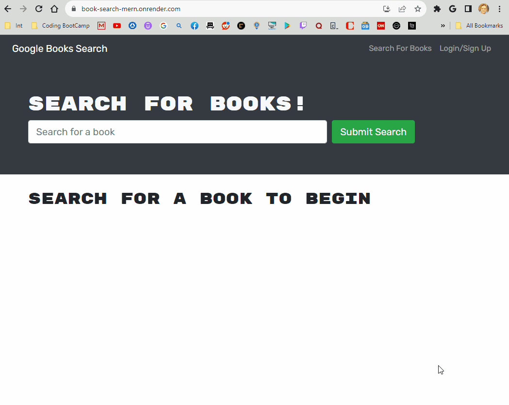

#📔 MERN: Book Search Engine 📕

## Technology Used

 

  

## Description

[Visit the Deployed Site](https://)

This is a full-stack web application that I used as an example of my ability to refactor the code.  It started out as a book search engine (searching Google Books) that used a RESTful API with all of the associated routes.  I refactored the code to be a GraphQL API built with Apollo Server.  This app was built using the MERN stack.  It has a React front end and I used a MongoDB database with Node.js/Express.js server and API.

A user can make an account.  Log into that account, search Google Books and save any books they find interesting.  That saved list will then be in their profile anytime they log back into the site.  The user can also remove books from their saved book list.

## Learning Points

### Steven Sills II

## Credits
